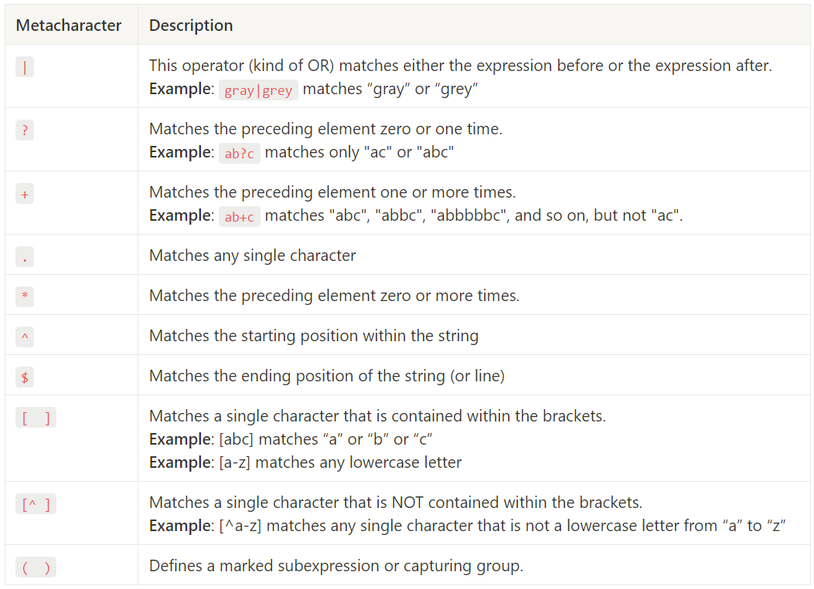

# Regular Expressions

Mastering regex can take a lot of your time, especially at the beginning, but you only need to practice.  
Use them in your C/C++ code but also inside scripts (Python) or directly in your editor (vi or notepad++).

## Overview

A **regular expression** (shortened as **regex** or **regexp**) is a sequence of characters that specifies a search pattern in text.  
Usually such patterns are used by string-search algorithms for: 

+ find and find-replace operations
+ input validation
+ log analysis

Most programming languages support regex either natively or via libraries.

A regex *pattern* matches a target *string*.  
The pattern is composed by a sequence of *atoms*. An atom is a single point within the regex pattern which it tries to match to the target string.

A match is made, not when all the atoms of the string are matched, but rather when all the pattern atoms in the regex have matched. The idea is to make a small pattern of characters stand for a large number of possible strings, rather than compiling a large list of all the literal possibilities.

## Syntax

Depending on the regex processor there are about fourteen metacharacters, characters that may or may not have their literal character meaning, depending on context, or whether they are "escaped", i.e. preceded by an escape sequence, in this case, the backslash `\`.



### Examples

- `.at` matches any three-character string ending with "at", including "hat", "cat", "bat", "4at", "#at" and " at" (starting with a space).
- `[hc]at` matches "hat" and "cat".
- `[^b]at` matches all strings matched by `.at` except "bat".
- `[^hc]at` matches all strings matched by `.at` other than "hat" and "cat".
- `^[hc]at` matches "hat" and "cat", but only at the beginning of the string or line.
- `[hc]at$` matches "hat" and "cat", but only at the end of the string or line.
- `\[.\]` matches any single character surrounded by "[" and "]" since the brackets are escaped, for example: "[a]", "[b]", "[7]", "[@]", "[]]", and "[ ]" (bracket space bracket).
- `s.*` matches s followed by zero or more characters, for example: "s", "saw", "seed", "s3w96.7".

## Use case scenario

Create a C++ program in order to validate a given email address (string).

```
mario.rossi@mail.com           --> OK
antonio@mail.com               --> INVALID
mario.rossi73@mail.com         --> OK
mario1.rossi@mail.com          --> INVALID
mario.giuseppe.rossi@mail.com  --> INVALID
mario.rossi@.com               --> INVALID
mario.rossi@casella            --> INVALID
mario.rossi@mail.a             --> INVALID
mario.rossi@posta.it           --> OK
```

These address are composed by different parts:

1. any lowercase or UPPERCASE letter repeated one or more times
2. a single dot
3. any lowercase, UPPERCASE letter or number repeated one or more times
4. the symbol @
5. any lowercase, UPPERCASE letter or number repeated one or more times
6. a single dot
7. any lowercase or UPPERCASE letter repeated two or three times

Regex:
^ [a-zA-Z]+ \. [a-zA-Z0-9]+ @ [a-zA-Z0-9]+ \. [a-zA-Z]{2,3} $

Regex in a shorter way:
^ [a-zA-Z]+ \. \w+ @ \w+ \. [a-zA-Z]{2,3} $


Then put the regex into C++ code (be care to escape char `\` ):

```cpp
#include <string>
#include <regex>

bool ValidateFunction(std::string sample)
{
  bool ret = false;
  std::string regex_pattern = "^[a-zA-Z]+\\.\\w+@\\w+\\.[a-zA-Z]{2,3}$";
  std::regex regex_rule(regex_pattern);

  ret = std::regex_match(sample, regex_rule);

  return(ret);
}
```


## Links

For a quick overview [Regex by Corey Schafer](https://youtu.be/sa-TUpSx1JA)

Alternative tutorial [C++ weekly regex](https://youtu.be/IOxKjqC1Ozo) and [C++ weekly regex optimization](https://youtu.be/7hfSyxNxFfo)

[Regex on Wikipedia](https://en.wikipedia.org/wiki/Regular_expression)

[Online checker for regex](https://regex101.com/)

## Books

**Mastering Regular Expressions**  
Jeffrey E F Friedl  
O’Really  

