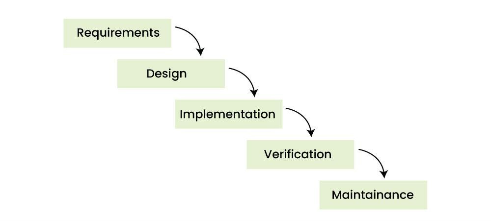
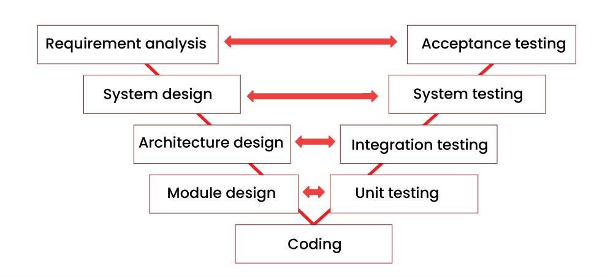
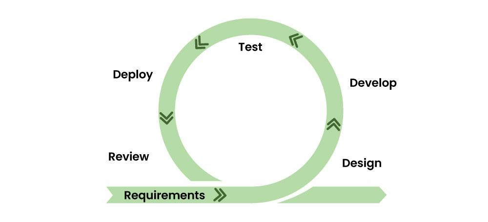

# SDLC models

Software Development Life Cycle Models (SDLC) are processes and methods applicable for project development depending on objectives, goals, and regulatory.  
These models serve as bluebrint to guide all the figures involved: designer, programmers, managers and stakeholders. Popular models are:

## Waterfall

It was the most popular way to develop software in the early days, but still is applied today with success in some context.  
It's a linear and sequential model, phases can't overlap. The output of one phase serves as input of the next one.

## V-model

This sequential model is used to produce rigorous development lifecycle models and project management models.  
The left side represents the decomposition of requirements, and the creation of system specifications. The right side represents an integration of parts and their validation. It's based on the association of testing phase with each development phase, both phases take place at the same time.

The V-model is a widely used development model for developing safety-critical systems. It provides a systematic approach to ensure the software is safe, reliable, and meets the requirements. By understanding the key concepts and stages of the V-model, software developers can ensure that their software meets the necessary quality standards.

## Iterative and Incremental models (Agile, Scrum, XP, ...)

In the Agile model the focus is process adaptability and customer satisfaction.  
The product is divided into small incremental parts developed over iteration. Each iteration is kept small, easily managed within two/three weeks.  
A team plan, develop and deploy only one interaction at a time.

## References

[SW dev life cycle on GeeksForGeeks](https://www.geeksforgeeks.org/software-engineering/software-development-life-cycle-sdlc)
