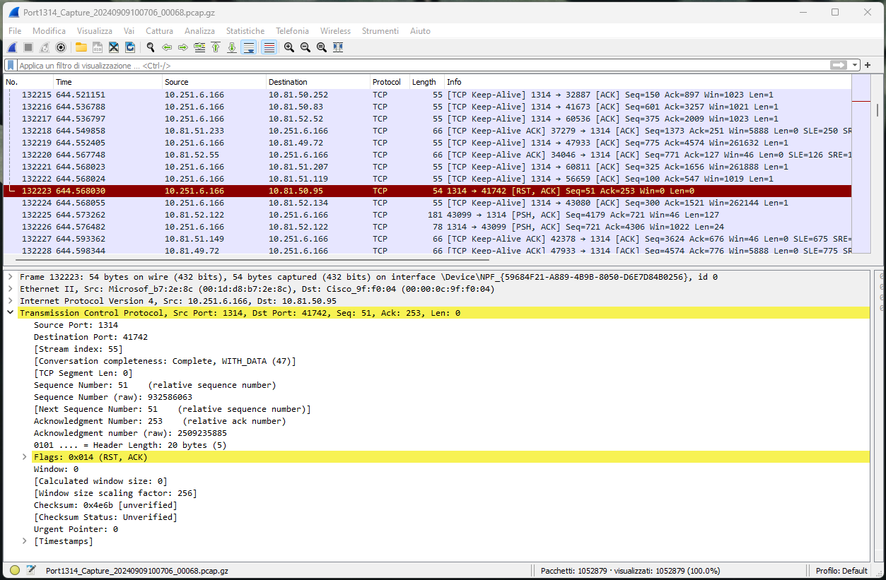

# Wireshark

A powerful opensource software for network traffic sniffing and analysis. A similar tool available only for Linux OS is **tcpdump** (explained on next section).

Download according to your OS release: [https://www.wireshark.org/download.html](https://www.wireshark.org/download.html)  
(For Windows OS it's highly recommended the *portable* version)

Official documentation: [https://www.wireshark.org/docs/wsug_html_chunked/](https://www.wireshark.org/docs/wsug_html_chunked/)

## Overview

Wireshark is a data capturing program (it uses **pcap**) for different networking protocols. It can parse and display the packet fields and related information.  

Features:

+ Data can be captured "from the wire" from a live network connection (Ethernet, IEEE 802.11, PPP, and loopback) or read from a file (trace) of already-captured packets.
+ Captured network data can be browsed via a GUI, or via the terminal (command line) version of the utility, TShark.
+ Captured files can be programmatically edited or converted via command-line switches to the "editcap" program.
+ Data display can be refined using a display filter.
+ Plug-ins can be created for dissecting new protocols.[23]
+ VoIP calls in the captured traffic can be detected. If encoded in a compatible encoding, the media flow can even be played.
+ Raw USB traffic can be captured.[24]
+ Various settings, timers, and filters can be set to provide the facility of filtering the output of the captured traffic.
+ Wireshark's native network trace file formats are the libpcap format read and written by libpcap, WinPcap, and Npcap, so it can exchange captured network traces with other applications that use the same format, including tcpdump and CA NetMaster, and the pcapng format read by newer versions of libpcap.

## How to sniff packets

TODO

## Traffic analysis

Acquire a new trace or load a previous acquisition (file with *.pcap* or *.pcap.gz* extension).

Apply some filters in order to highlight the behavior of the devices and the flow of messages. Filters can be combined together via `or`, `and` operators.

### TCP filtering

Show packets with specific source/destinatio/both ports:

```text
tcp.srcport==PORTNUMBER
tcp.dstport==PORTNUMBER
tcp.port==PORTNUMBER
```

Show packets with specific properties:

```text
tcp.flags.reset==1
tcp.flags.syn==1
...

for TCP flags like ACK, SYN ...
    000. .... .... = Reserved
    ...0 .... .... = Accurate ECN
    .... 0... .... = Congestion Window Reduced
    .... .0.. .... = ECN-Echo
    .... ..0. .... = Urgent
    .... ...0 .... = Acknowledgment
    .... .... 0... = Push
    .... .... .0.. = Reset
    .... .... ..0. = Syn
    .... .... ...0 = Fin
```

Show packets related with a specific behavior (explore the `analysis` menu for more options)

```text
tcp.analysis.spurious_retransmission
tcp.analysis.reused_ports
...
```

### IP filtering

Show packets with specific source/destinatio/both IP address:

```text
ip.src==IPADDRESS
ip.dst==IPADDRESS
ip.addr==IPADDRESS
```

### Example

This trace was acquired on the server side, during some monitoring tests. The user raised some concerns about a device disconnection.  
Logs on the device highlighted a *disconnection indication* on communication stack (due to RST packet sent by the server) 

*server IP address=10.251.6.166*  
*server PORT=1314*

*client device IP address=10.81.50.95*  
*client PORT=41742*



Workflow:

1. Get the network topology and devices configuration
2. Understand the meaning/theory about RST packet (when it's used and who send it):
    
    ```text
    List of reasons for the server to send the RST:
    
    	A: Non-Existence TCP endpoint
    	The client sends SYN to a non-existing TCP port or IP on the server side. The server will send a reset to the client.
    
    	B: SYN matches the existing TCP endpoint
    	The client sends SYN to an existing TCP endpoint, which means the same 5-tuple. The server will send a reset to the client.
    
    	C: Accept Queue Full
    	When the accept queue is full on the server side, the server will send a reset to the client.
    
    	D: Half-Open Connections
    	When the server restarts itself. Then all connections before would receive a reset from the server side.
    
    	E: Firewall
    	The firewall/routers could send a reset to the client or server (due to idle time or other reasons)
    	Example: if there is a router doing NAT, especially a low end router with few resources, it will age the oldest TCP sessions first. To do this it sets the RST flag in the packet that effectively tells the receiving station to (very ungracefully) close the connection. this is done to save resources.
    
    	F: Time-Wait Assassination
    	When the client in the time-wait state, receives a message from the server-side, the client will send a reset to the server.
    
    	G: Aborting Connection
    	When the server aborts the connection, it could send a reset to the client
    	The RST packets are only sent by the server.
    	
    	H: Connection Timeout
    	If a TCP connection is idle for an extended period, one of the parties might send a reset packet to close the connection (in most applications, the socket connection has a timeout).
    	Example: FTP server, if you connect to the server and just leave the connection without browsing or downloading files, the server will kick you off the connection, usually to allow others to be able to connect.
    	
    	I: Application protocol error
    	TCP reset is sent when the peer (the other end of the connection) closes its socket while there is still unread data pending in its socket receive buffer.
    ```

3. Filter RST packets and look for a relation with other messages
4. Check the presence of:
    - "Spurius retransmission”
    - "Duplicated ack”
5. Open application source-code and verify how the TCP-stack is implemented (it's usually and external library like lwIP, ...).
6. Verify that application manages connections as defined by protocol documentation.
    
    ```text
    TCP supports two types of connection releases like most connection-oriented transport protocols:

    	GRACEFUL connection release
    	In the Graceful connection release, the connection is open until both parties have closed their sides of the connection.
    	The common way of terminating a TCP connection is by using the TCP header’s FIN flag. This mechanism allows each host to release its own side of the connection individually.
    
    	ABRUPT connection release
    	In an Abrupt connection release, either one TCP entity is forced to close the connection or one user closes both directions of data transfer.
    	An abrupt connection release is carried out when an RST segment is sent.
    ```

# Tcpdump

TODO

## Overview

TODO

## How to use it

TODO